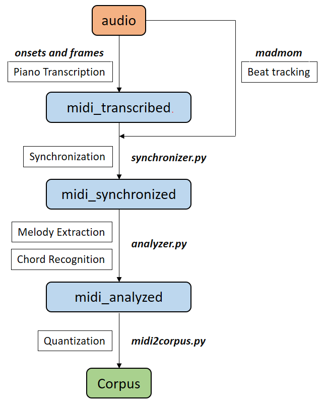

# Datasets

In this document, we demonstrate our standard data processing pipeline in our team. Following the instructions and runnung corresponding python scripts, you can easily generate and customized your your own dataset.

## 1. From `audio` to `midi_transcribed`
We collect audio clips of piano performance from YouTube.

* run google magenta's [onsets and frames](https://github.com/magenta/magenta/tree/master/magenta/models/onsets_frames_transcription)

## 2. From `midi_transcribed` to `midi_synchronized`
In this step, we use [madamom](https://github.com/CPJKU/madmom) for beat/downbeat tracking. Next, We interpolate 480 ticks between two adjacent beats, and map the absolute time into its according tick. Lastly, we infer the tempo changes from the time interval between adjacent beats. We choose beat resolution=480 because it's a common setting in modern DAW. Notice that we don't quantize any timing in this step hence we can keep tiny offset for future purposes.

* run `synchronizer.py`

## 3. From `midi_synchronized` to `midi_analyzed`
In this step, we develop in-house rule-based symbolic melody extraction and chord recognition algorithm to obtain desired information. Only codes for chord are open sourced [here](https://github.com/joshuachang2311/chorder).

* run `analyzer.py`

## 4. From  `midi_analyzed` to `Corpus`
We quantize every thing (duration, velocity, bpm) in this step. Also append the data with EOS(end of sequence) token. 

* run `midi2corpus.py`

## 5. From `Corpus` to `Representation`
We have 2 kinds of representation - Compound Word (**CP**) and **REMI**, and 2 tasks - unconditional and conditional generation, which resulting 4 combinations. Go to corresponding folder `task\repre` and run the scripts.

* run `corpus2events.py`: to generate human readable tokens and re-arrange data.
* run `events2words.py`: to build dictionary and renumber the tokens. 
* run `compile.py`: to discard disqualified songs that exceeding length limits, reshape the data for transformer-XL, and generate mask for variable length. 

---

## AILabs.tw Pop17K dataset

Alternatively, you can refer to [here](https://drive.google.com/drive/folders/1DY54sxeCcQfVXdGXps5lHwtRe7D_kBRV?usp=sharing) to obtain the entire workspace and pre-processed training data, which originally used in our paper.